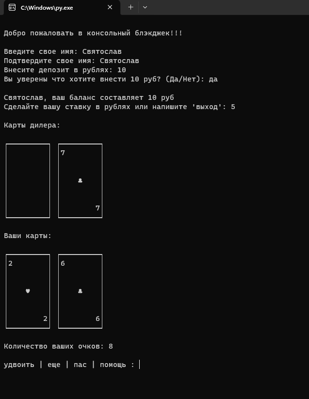
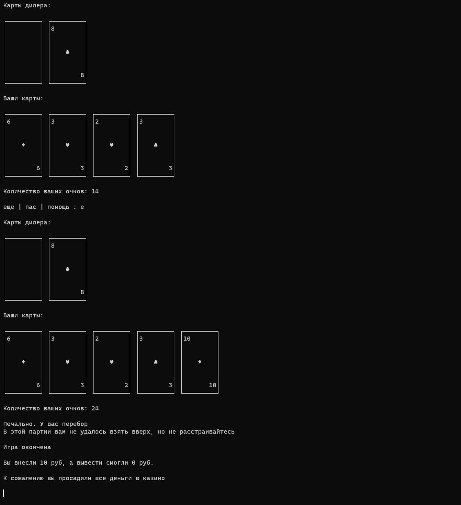

<a id="up"></a>
#  Console Blackjack
____

____
<p align="left">
  <a href="https://github.com/svyatoslav-rozhdestvenskiy">
    
  </a>
  
  

</p>

____
# Описание

Всем известный blackjack теперь в консоли. Скачай и играй прямо на рабочем месте! Может именно тебе удастся разорить дилера?

____
# Скриншоты из игры





____

# Инструкция по установке для простых пользователей Windows
1. Скачайте [архив](https://github.com/svyatoslav-rozhdestvenskiy/console_blackjack/archive/refs/heads/master.zip) репозитория
2. Разархивируйте его, вам нужна только папка `blackjack`
3. С [официально сайта](https://www.python.org/downloads/) Python скачайте и установите последнюю версию для вашей ОС
4. Запустите файл main.py и наслаждайтесь игрой
5. Или откройте терминал в папке с игрой и запустите `main.py`
```commandline
python main.py
``` 

____

# Инструкция по установке для продвинутых пользователей
1. Клонируйте репозиторий
```commandline
git clone https://github.com/svyatoslav-rozhdestvenskiy/console_blackjack.git
```
2. Перейдите в папку программы
```commandline
cd console_blackjack
```
3. Создайте виртуальное окружение
```commandline
 python -m venv venv
 ```
4. Активируйте виртуальное окружение
+ Для Linux
```commandline
source venv/bin/activate
```
+ Для Windows
```commandline
venv\Scripts\Activate.ps1
```
5. Установите зависимости (пока требуется базовый питон)
```commandline
pip3 install -r requirements.txt
```
6. Перейдите в папку `blackjack`
```commandline
cd blackjack
```
7. Запустите файл `main.py`
```commandline
python main.py
```

____

# Пожелания и рекомендации
Если вас заинтересовал проект и у вас есть предложения по его улучшению, то пишите, не стесняйтесь.
Мои контакты вы сможете найти на [главной странице профиля](https://github.com/svyatoslav-rozhdestvenskiy)


<a href="#up">Ссылка для перехода наверх, чтобы не листать</a>